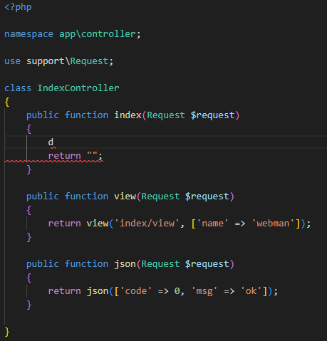
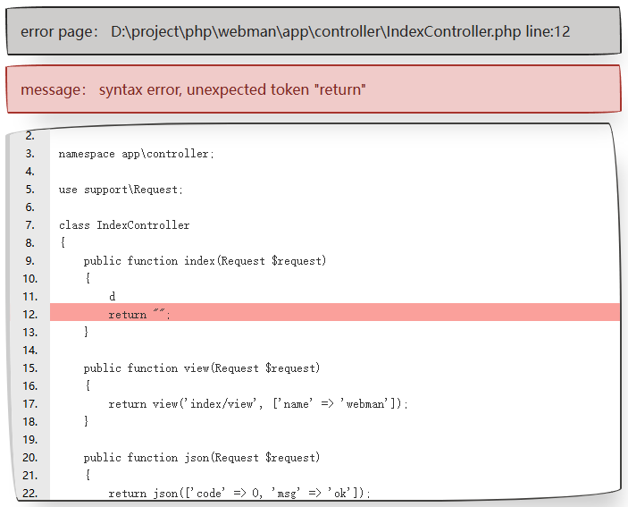

# kllxs-exception
😘 Webman 简 易 报 错 页 面 Webman plugin kllxs/exception

设置 `config/exception.php` 文件

```php
return [
    // '' => support\exception\Handler::class,
    '' => Kllxs\Exception\Handler::class
];
```

`config/plugin/kllxs/exception/app.php` 文件配置说明

```php
return [
    'enable' => true, // 开启
    // 模板路径
    'template' => base_path()
        . DIRECTORY_SEPARATOR . "vendor"
        . DIRECTORY_SEPARATOR . "kllxs"
        . DIRECTORY_SEPARATOR . "exception"
        . DIRECTORY_SEPARATOR . "src"
        . DIRECTORY_SEPARATOR . "template.html"
];
```

例子



结果

